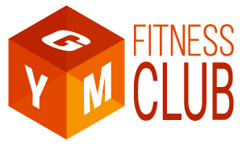
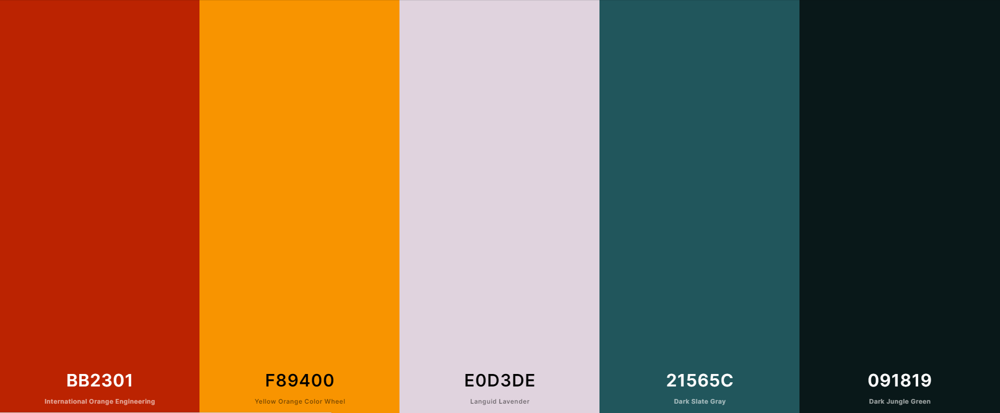
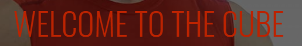
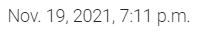

# milestone-project-04
# Full Stack Frameworks with Django / The CUBE | GYM & Fitness Club

[Live site on Heroku](https://thecube-gym-fitness-club.herokuapp.com)

# Author
Andrej Cybovskij

## Table Of Contents
- [milestone-project-04](#milestone-project-04)
- [Full Stack Frameworks with Django / The CUBE | GYM & Fitness Club](#full-stack-frameworks-with-django--the-cube--gym--fitness-club)
- [Author](#author)
  - [Table Of Contents](#table-of-contents)
  - [Project Overview](#project-overview)
  - [UX](#ux)
    - [Project Goals](#project-goals)
      - [The goals of this project are:](#the-goals-of-this-project-are)
      - [User Goals](#user-goals)
      - [Developer Goals](#developer-goals)
    - [User Stories](#user-stories)
    - [Design Choices](#design-choices)
      - [Colors](#colors)
      - [Typography](#typography)
      - [Images](#images)
      - [Design Elements](#design-elements)
      - [Animations and Transitions](#animations-and-transitions)
    - [Wireframes](#wireframes)
    - [Features](#features)
    - [Database Planning](#database-planning)
      - [Implemented Features](#implemented-features)
      - [Future Features](#future-features)
  - [Technologies Used](#technologies-used)
    - [Programing Languages](#programing-languages)
    - [Frameworks and Libraries:](#frameworks-and-libraries)
    - [Fonts](#fonts)
    - [Tools and Resources](#tools-and-resources)
  - [Testing](#testing)
  - [Version Control](#version-control)
  - [Deployment](#deployment)
    - [Requirements](#requirements)
    - [To deploy this project, the following steps were taken:](#to-deploy-this-project-the-following-steps-were-taken)
      - [Create Heroku new app:](#create-heroku-new-app)
      - [Set up Database:](#set-up-database)
      - [Upload static & media Files to AWS:](#upload-static--media-files-to-aws)
      - [Finish deploying on Heroku:](#finish-deploying-on-heroku)
  - [Credits](#credits)
    - [Content](#content)
    - [Media](#media)
    - [Code Snippets and Tutorials](#code-snippets-and-tutorials)
    - [Acknowledgments](#acknowledgments)

## Project Overview

- Below is a picture of site that shows it in responsive states. 
[link to check a website to be responsive](http://ami.responsivedesign.is)

- The CUBE | GYM & Fitness Club is a website, where user can get all necessary information about the GYM & Fitness Club. Before or after getting Club membership, user can navigate and research all Club’s proposed services and facilities. There is a short information about Club’s stuff and their experience. Activities section is created to provide information about all Exercise plans and classes they have or will have in the future. Timetable section is created to provide information about all classes times and Fitness Instructors working on them. Shop Section is created to navigate user to fully functional Merchandise online Shop. In that section user can enjoy all ecommerce website possibilities and join a fitness community and purchase Club’s exercise plans and merchandise.
- This is a version 1 and contents just a minimal options and features. However, this version has very high commercial feature, because during the last year all businesses are moving to online commerce. Ecommerce features allows even for the Gym and Fitness business to survive by selling their merchandise online. As well website has modern design and lot of visual components. Design was build using last UI/UX technologies.

- [Link to a deployed website](https://thecube-gym-fitness-club.herokuapp.com)

## UX

### Project Goals

#### The goals of this project are:
- Design, develop and implement a dynamic web application using HTML, CSS, JavaScript Python+Django, relational database (recommending MySQL or Postgres), Stripe payments and additional libraries and APIs
- Meet the target audience users’ needs using UI/UX design principles
- Implement a Django project backend by a relational database to create a website that allows users to store and manipulate data records
- Test a web application through the development, implementation, and deployment stages
- Deploy the final version of the web application to a Cloud platform Heroku
- Demonstrate and document the development process through a version control system
- Learn Python+Django theory and practically implement all gained knowledge

#### User Goals

- The target audience of this website is quite wide. They are different age, status, families or single people.

Common types of users are:
- As a **New customers** I want to be able to ..
    1. Get all necessary Gym related information such ass Classes, Timetables, Stuff, Equipment, Facilities and get some preview from inside
    2. Use the site intuitively
    3. To purchase exercise plans and merchandise
    4. To register an account
    5. To search for plans and merchandise products
    6. View the details of individual products
    7. To order plan or merchandise products by category
    8. To order merchandise products by finer details such as A-Z, price low to high or vice versa
    9. To add any product to my basket and checkout, without/with an account
    10. To be informed throughout messages about my actions on the site.

- As an **Existing customer** Additionally to a new customers, I want to be able to ..
    1. Have a persona profile with all possible functionality
    2. View my previous orders
    2. Save/ update default delivery information

- As an **Site Owner/ Admin** I want to be able to ..
    1. Encourage people to use my website
    2. Sell Exercise Plans, Nutrition Plans, Nutrition and exercise products
    3. Add new plans and merchandise products
    4. Edit plans and product details
    5. Have a fully functional and easy to use payment system
    6. Provide a contact form where users can send any questions and enquires

#### Developer Goals
1.  Build a Django project backend by a relational database to create a website that allows users to store and manipulate data records.
2.  Use Multiple Apps structure.
3.  Data Modelling trough the relational database schema well-suited for the project.
4.  The project should include an authentication mechanism, allowing a user to register and log in.
5.  User Interaction to allow user to create and edit models in the backend.
6.  Use of Stripe for e-commerce functionality using Stripe.
7.  Incorporate a main navigation menu and structured layout.
8.  Use of some JavaScript logic you have written to enhance the user experience.
9.  Provide off necessary documentation through README.md file to explain what the project does and the value that it provides to its users.
10. Use of Git & GitHub for version control.
11. Made a clear attribution between code written by the author and code from external sources.
12. Deploy the final version of the code to a hosting platform such as Heroku.
13. Do not include any passwords or secret keys in the project repository.

### User Stories

- Viewing and Navigation
  - As a Shoper, I want to be able to ..
    1. View a list of products select some to purchase
    2. View individual product details. Identify the price, description, product image
    3. Quickly identify deals, clearance items and special offers. Take advantage of special savings on products I'd like to purchase
    4. Easily view the total of my purchases at any time. Avoid spending too much

- Registration and User Accounts
  - As a Site User, I want to be able to ..
    5. Easity register to an account. Have a personal account and be able to view my profile
    6. Easily to login or logout. Access my personal account information
    7. Easily to recover my password in case I forgot it. Recover access to my account
    8. Receive an email confirmation after registering. Verify that my acount registration was successful
    9. Have a personalized user profile. View my personal order history and order confirmations and save my payment information

- Sorting and Searching 
  - As a Shoper, I want to be able to ..
    10. Sort the list of available products Easily identify the best priced and categorically sorted products
    11. Sort a specific category of product. Find the best priced product in a specific category or sort the product in that category by name
    12. Sort multiple categories of products simultaneously. Find the best priced across broad categories, such as food or merch
    13. Search for a product by name or description. Find a specific product I'd like topurchase
    14. Easily see what I've searched for and the number of results. Quickly decide whether the product I want is available
    15. Easily select the quantity of a product when purchasing it. Ensure I don’t accidentally select the wrong product
    16. View items in my bag to be purchased. Identify the total cost of my purchase and all items I will receive
    17. Adjust the quantity of individual items in my bag. Easily make changes to my purchase before checkout
    18. Easily enter my payment information. Check out quickly and with no hassles
    19. Feel my personal and payment information is safe and secure. Confidently provide the needed information to make a purchase
    20. View an order confirmation after checkout. Verify that I haven't made any mistakes
    21. Receive an email confirmation after checking out. Keep the confirmation of what I've purchased for my records

- Admin and store manager
  - As a Store Owner, I want to be able to ..
    22. Add a product. Add new items to my store
    23. Edit / Update a product Change product price, description, images and other product criteria
    24. Delete Product. Remove items that are no longer for sale

### Design Choices
- This project was created based on the target audience needs and requirements. The target audience is a quite wide range of active people who likes sport and want to be in a good shape.
Based on the website theme, were chosen Reddish (International Orange), orange (yellow orange) and three shades of green (Dark state, Midnight Green and Rich black) colors as a main brand colors. 
According to [Color Meanings website]( https://www.color-meanings.com/color-psychology-in-sports/) and Shirley J. Wenrich, author of the book All the Colors of Life: From the History and Mystery of Color, red is the best color for sports as it represents energy and vitality. It’s using as a small accent colors. It’s very handy in gym area. It subconsciously push and supports users to work with the heavy weights.
Orange is inexorably linked to radiant energy. In sports, orange is a great color as it symbolizes strength and endurance. Orange is associated with warmth and the earth. Sports teams and the youth heartily accept this trendy color that combines strength and wisdom. Our orange color is closer to Yellow color. Yellow is the radiant and energetic color of sunshine and warmth. There is no individual who would not feel cheered and comforted when surrounded by vibrant yellow.

- For centuries, green is associated with wealth and health. It also stands for life and the environment. In sports, green represents the will to win and be cheerful. Our green is closer to Blue color. Blue is a calming color in sports. It represents a team or individual that is honest, calm, truthful, and sincere.
All those characteristics are doing unusual but very good combination for the Gym and Fitness Club theme.
Website design is quite dark, but it gives some uniqueness and exclusive club’s atmosphere. People like to get some exclusivity feeling. Gym area is quite individual sport and dark colors does not distract attention from the sport and allows user to concentrate on their tasks.
Differently from the gym sections and information, shopping area’s background color is white and gives user possibility to simple use and read lot of information about shopping products.
Website contains a lot of images, but parallax effect does not overload attention. According to the last trends, design stays clean and simple. 
According to user requirements, website should stay useful, usable and valuable for everybody. To achieve value from design were used user experience five planes:

- **Strategy Plane**  – aiming to achieve in the first place and for whom. The users of this website are people who likes sport and want to get all necessary information about Club and their services. The website should be quite simple and universal for everybody. Navigation is universal for desktop and mobile versions and is quite standard and known by every online user. Traditional rule is no more than 3 clicks to search or get other information was using during the planning and implementing this project.

- **Scope plane** - represents features we want to include into design. 
  - This project includes following features: 
    - Header / Mobile navigation.
    - Registration system.
    - Login functionality.
    - Create, Read, Update and Delete functionality.
    - Intuitive design.
    - SVG logo on top of the page.
    - Grid/Card images as a visual representative.
    - Search functionality.
    - Social media icons.

- **Structure plane** - this project’s information is structured and logically placed into the navigation. As well, this project's content is taken from the database. The structure of Database tables is presented in the [database schemas](DATABASE.md).

- **Skeleton plane** - part for mock-ups:
  - Wireframes links are presented below:
    - [Link to a Wireframes for a Desctop view](assets/documents/project-3-desctop-wireframes.pdf)
    - [Link to a Wireframes for Tablet view ](assets/documents/project-3-tablet-wireframes.pdf)
    - [Link to a Wireframes for Mobile view ](assets/documents/project-3-mobile-wireframes.pdf)

- **Surface plane** - it is a final part of design procedure. The project is built in modern design using parallax effect on many images. The project is orientated more into the data manipulating and working with shopping bag and payment system. However, the website stays modern design, useful, usable, and valuable for everybody.

#### Colors
The color palette were created using information from resources about The Psychology Behind Colors in Sports: How They Matter.  [Color Meanings website]( https://www.color-meanings.com/color-psychology-in-sports/) by  Shirley J. Wenrich, author of the book All the Colors of Life: From the History and Mystery of Color.

- The color brand one is Reddish color (International Orange). It is using for H1 titles and button hovers to attract attention.
- The color brand two is Orange color (Yellow Orange). It is used for H2 titles and different buttons. to attract attention. The color is working very well as a contrast color for the third brand color. Both red and yellow are also effective at grabbing attention.
- The color brand three is Green color (Dark state, Midnight Green(a) and Rich black(b)). It is used for H3 titles and in many section / grids / cards as a background colors. In this project were used three shades of green color to do some gradient effect on the page.
- The color brand four is Languid Levander color. It is used as neutral base color on some lines and backgrounds.
- The color brand five is a Dark Jungle Green color. It is dark color and used for main content font on white backgrounds and all dark design elements to make them visible to user. This color is used for the footer background as a finishing page gradient color.

- Color palete was created using [Coolors resources](https://coolors.co)
- 

#### Typography
- Roboto sans-serif typeface family font was using in this project for the body text. Body font size is 16px. This body font is very common as neutral, easy to read and good for design. It is very universal and has very wide range of font weights.
- All titles H1 and H2 are in Oswald sans-serif font’s family.
- H3 titles are in Roboto Mono monospace font’s family.
- All H4 – H6 titles are in Oswald sans-serif typeface font’s family.
- According to Google Font, Oswald is a reworking of the classic style historically represented by the 'Alternate Gothic' sans serif typefaces. Font is narrow and looks very elegant for the fitness sections.
- Roboto Mono is optimized for readability on screens across a wide variety of devices and reading environments. Added serifs makes this font standout from the Roboto font family and looks like barbell from the Gym. 
-  H1 as main title is in size of 50px. It is quite big size but looks very stylish and attract attention. H2 title is in size of 40px. H3 titles are in size of 30px.
- All fonts are reduced in size for mobile devices to fit into the small screen of devices:
- H1 = 40px, H2 = 35px, H3 = 27px.
- body font is in same size for mobile devices.

- Font examples are presented below:
- H1 Oswald 50px 
- H2 Oswald 40px 
- H3 Roboto Mono 30px 
- Paragraph (body) Roboto 16px 
- [Oswald font can be found here](https://fonts.google.com/specimen/Oswald?query=oswa)
- [Roboto Mono font can be found here](https://fonts.google.com/specimen/Roboto+Mono?query=robot)
- [Roboto font can be found here](https://fonts.google.com/specimen/Roboto?query=robot)
 

#### Images
- To demonstrate main Gym and Fitness theme, in this project were used lot of colourful images.
- As well a lot of images were using for shopping pages.
- Font Awesome icons were used to visually represent all major social media resources and as additional information on buttons. 
- [Images and logo were taken from the Megapixl resources](https://www.megapixl.com)
- [Shopping page images were taken from the Boutique Ado and Kaggle website](https://www.kaggle.com/datasets)
- [Nutrition images were taken from the HPnutrition website](https://www.hpnutrition.ie/)

#### Design Elements
List of all elements used on website: 
- top menu (desktop/mobile navigation)
- footer
- containers/cards
- check boxes
- buttons
- text input
- textarea inputs
- images (.png, .jpg, .svg)
- icons
- forms

#### Animations and Transitions

Project has a limited range of animations. It draws attention to the elements.
- Animation is added to the following elements:
  - **Hover** state is used for all icons, header navigation and buttons. On hover, they are changing background and text colors sliding from bottom to top.
  - **Sliding from the bottom** animation is added to buttons, h1, h2 titles. As well this animation is added to all forms.

### Wireframes

The wireframes were created using [Balsamiq](https://balsamiq.com/wireframes/) software. It was a part of Scope Plane of design process.
- Wireframes links are presented below:
- [Link to a Wireframes for a Desctop view](assets/documents/desctop.pdf)
- [Link to a Wireframes for Tablet view ](assets/documents/tab.pdf)
- [Link to a Wireframes for Mobile view ](assets/documents/mobile.pdf)

### Features

Following features will be used in this project:

  - Intuitive design. Design is clear and understandable.
  - Designed with HTML5, CSS, JavaScript and Bootstrap libraries.
  - Universal Desctop/Mobile Hamburger menu navigation. Simple and easy to navigate.
  - Clickable Header logo.  
  - Search functionality.
  - Registration functionality.
  - Login functionality.
  - Create,read, update and delete functionality for the admin user.
  - Database connection and data handling.
  - Login / Register and other forms with CTA.
  - Floating notifications for the user.
  - Integrated payment system.
  - Email notifications.
  - Social media icons are at the bottom of every page.

### Database Planning

The database "The CUBE | GYM & Fitness Club" will contain 4 collections: Categories, Products for the Products App and Role, Employee for the Employee App
- [Link to a database schema](DATABASE.md)

#### Implemented Features

All planned features are implemented and working properly

#### Future Features

Features to be implemented in the future:
- Add contact form and newsletter sign up form
- Add training classes and connect them to timetable
- Make interactive timetable
- Add training classes review possibility
- Add product’s rating possibility
- Add personalized flexible Club subscription
- Integrate partners adds to website

## Technologies Used

The following languages, frameworks, libraries, and other tools were used to construct this project:

### Programing Languages
- [HTML](https://www.w3schools.com/html/default.asp) The project uses **HTML** to define DOM elements.
- [CSS](https://www.w3schools.com/w3css/default.asp) The project uses **CSS** to define DOM appearance.
- [JavaScript](https://www.javascript.com) The project uses **JavaScript** to interact with content. 
- [Python](https://www.python.org) The project uses **Python** high-level general-purpose programming language.
- [Markdown](https://www.markdownguide.org/) Documentation within the readme was generated using markdown.

### Frameworks and Libraries:
- [Bootstrap](https://getbootstrap.com/) In the project were used **Bootstrap** CSS framework for styling, layout and typography.
- [Django](https://www.djangoproject.com) The project uses **Django** web framework that follows the model–template–views architectural pattern.
- [MySQL](https://www.mongodb.com/) Database Service. In the project were used **MySQL** to store data objects.
- [Heroku](https://heroku.com/) In the project were used **Heroku** cloud platform for deployment.
- [GitHub](https://github.com) In the project were used **GitHub** hosting platform for version control.
- [Stripe](https://stripe.com/ie) In the project were used **Stripe** Online payment processing for internet businesses.
- [Amazon Web Services AWS](https://aws.amazon.com/s3/) In the project were used **Amazon Web Services AWS** as a storage service for static and media files.
- [Gmail](https://mail.google.com) In the project were used **Gmail** email service for login registration and confirmation.

### Fonts
Google Fonts:
- [Oswald font can be found here](https://fonts.google.com/specimen/Oswald?query=oswa)
- [Roboto Mono font can be found here](https://fonts.google.com/specimen/Roboto+Mono?query=robot)
- [Roboto font can be found here](https://fonts.google.com/specimen/Roboto?query=robot)

### Tools and Resources
- [Wirefames by Balsamiq](https://balsamiq.com/wireframes/) - to create professional looking wire frames
- [Am I Responsive](http://ami.responsivedesign.is/) - to checks for responsive website and mockup image generator.
- [Color palette resources](https://coolors.co) - to create color palette
- [Markdown table generator](https://www.tablesgenerator.com/markdown_tables)
- [Markdown table of contents](http://ecotrust-canada.github.io/markdown-toc/) to create table of contents
- [Youtube](https://www.youtube.com/watch?v=rz_8NDyC6Xk)- General resource.
- [Stack Overflow](https://stackoverflow.com/) - General resource.
- [W3Schools Online Web Tutorials](https://www.w3schools.com/)
- [ImgBB -free image hosting and sharing service](https://imgbb.com/)

## Testing
Details of testing can be found in a separate document
- [Link to a testing document](TESTING.md)

## Version Control
 - Used Git for version control.
 - Additional copy vere created localy
 - Constantly versions were updated and merged

## Deployment

This project was developed using open source Heroku cloud Platform. All necessary documentation can be found on Heroku website:
- [Deploying with Git](https://devcenter.heroku.com/articles/git#prerequisites-install-git-and-the-heroku-cli)
- [Heroku GitHub Deploys](https://devcenter.heroku.com/articles/github-integration)

### Requirements
- project ready to deploy
- Python3
- GitHub account
- Heroku account
- Gitpod or an IDE of your choice
- Stripe account
- AWS Amazon account
- Gmail account

### To deploy this project, the following steps were taken:

#### Create Heroku new app:
  - Log in or sign up to Heroku and create a new app.
  - Choose location and app name.
  - In resources tab search for postgres library and add to your app.
  - Go to the Settings tab and under Config Vars choose Reveal Config Vars, then enter the following config vars:
      
        KEY VALUE
        AWS_ACCESS_KEY_ID <aws access key>
        AWS_SECRET_ACCESS_KEY <aws secret access key>
        DATABASE_URL  <postgres database url>
        EMAIL_HOST_PASS <email password(generated by Gmail)>
        EMAIL_HOST_USER <email address>
        SECRET_KEY  <your secret key>
        STRIPE_PUBLIC_KEY <your stripe public key>
        STRIPE_SECRET_KEY <your stripe secret key>
        STRIPE_WH_SECRET  <your stripe wh key>
        USE_AWS True

#### Set up Database:

  - Copy the DATABASE_URL (Postgres URL) from the config variables of Heroku and paste it into the default database in settings.py.
  - DATABASES = { 'default': dj_database_url.parse("<DATABASE_URL>") }
  - Migrate the models to create the database
  - Load the data fixtures for all databases: (loading order is mater)
  - python3 manage.py loaddata name of database (load all existing databases)
  - Create a superuser
  - Remove the DATABASE_URL from settings.py

#### Upload static & media Files to AWS:
  - Create AWS S3 Bucket.
  - Set up a group
  - Set a policy and user in the IAM environment.
  - All details on AWS S3 parameters and a explanation you can find out more [here.](https://aws.amazon.com/s3/)
  - upload static files to static folder
  - upload media files to media folder

#### Finish deploying on Heroku:

  - Select deploy tab and under deployment method choose GitHub
  - In connect to GitHub, search for a repository to connect - enter your GitHub repository name. When you see your repository, click connect.
  - In Automatic deploys section, enable automatic deploy functionality.
  - In Manual deploy section press Deploy Branch button to deploy your project.
  - Enjoy

## Credits

### Content

- [GO GYM Limerick](https://gogymlimerick.ie/) Go Gym Sport Club Limerick 
- [HPnutrition](https://www.hpnutrition.ie/)  Ireland’s largest online sports supplements store
- [Boutique Ado and Kaggle website](https://www.kaggle.com/datasets) images and shopping products

### Media

- The images used in this project were obtained from the [Megapixl resources](https://www.megapixl.com)
- Icons [Font Awesome](https://fontawesome.com/v4.7.0/)
- SVG logo, menu icons and favicon - base is taken from [Megapixl resources](https://www.megapixl.com) and modified on [Adobe Illustrator](https://www.adobe.com/products/illustrator.html)
- Image optimisation - self-made on [Adobe Photoshop](https://www.adobe.com/products/photoshop.html)

### Code Snippets and Tutorials

- Code Institute Tutorials [User Authentication And Authorization 1](https://www.youtube.com/watch?v=pwmJLp2jots&t=413s)
- Code Institute Tutorials [User Authentication And Authorization 2](https://www.youtube.com/watch?v=TmdKjjnGWyo)
- Code Institute Tutorials [Profiles App](https://www.youtube.com/watch?v=9LKzhVoKZy4&t=373s)
- Code Institute Tutorials [Users Profile Page](https://www.youtube.com/watch?v=NQxmvrqpSr0&t=396s)
- Code Institute Tutorials [Products App Models and Fixtures](https://www.youtube.com/watch?v=bachwkoB2bk&t=10s)
- Code Institute Tutorials [E commerce Toasts](https://www.youtube.com/watch?v=cwhROnUBZbQ)
- Code Institute Tutorials [Checkout App/ Stripe](https://www.youtube.com/watch?v=or9zOswvISY&t=194s)
- Code Institute Tutorials [Deployment / Heroku and AWS](https://www.youtube.com/watch?v=6mv-Qp37X4I)
- Code Institute Tutorials [Sending Real Emails with Django](https://www.youtube.com/watch?v=uCtLfAd6w-c)
- Code Institute Tutorials [Checkout App](https://www.youtube.com/watch?v=eAja_pKhiCM&t=387s)
- Code Institute Tutorials [The Shopping Bag](https://www.youtube.com/watch?v=2G9j34jz42Q&t=366s)

### Acknowledgments

I would like to thank:
- My mentor [Malia Havlicek](https://code-institute-room.slack.com/team/UERRFE54G) for help in testing, review and invaluable advices.
- Code Institute Chris Z for Boutique Ado project [tutorial](https://github.com/Code-Institute-Solutions/boutique_ado_v1). It was extremely useful and informative
