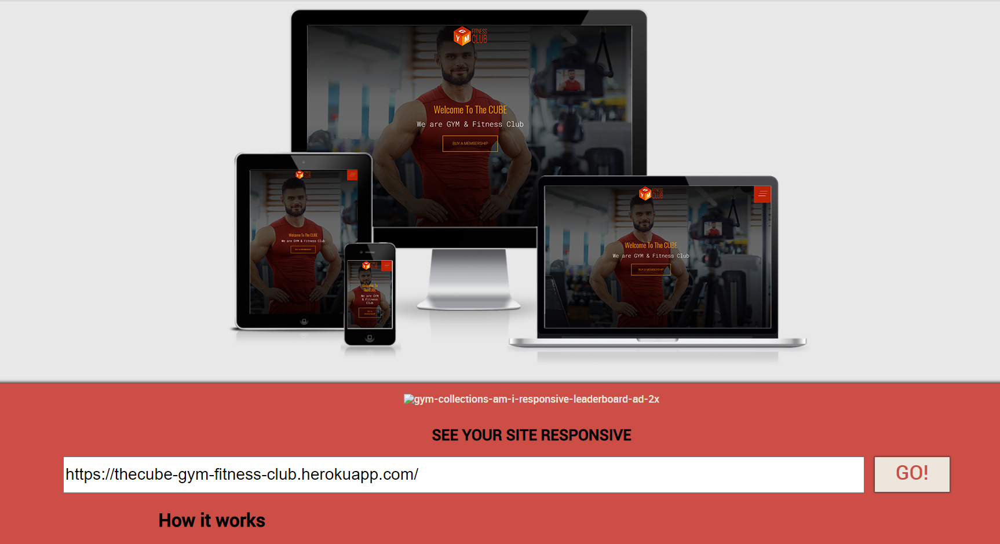
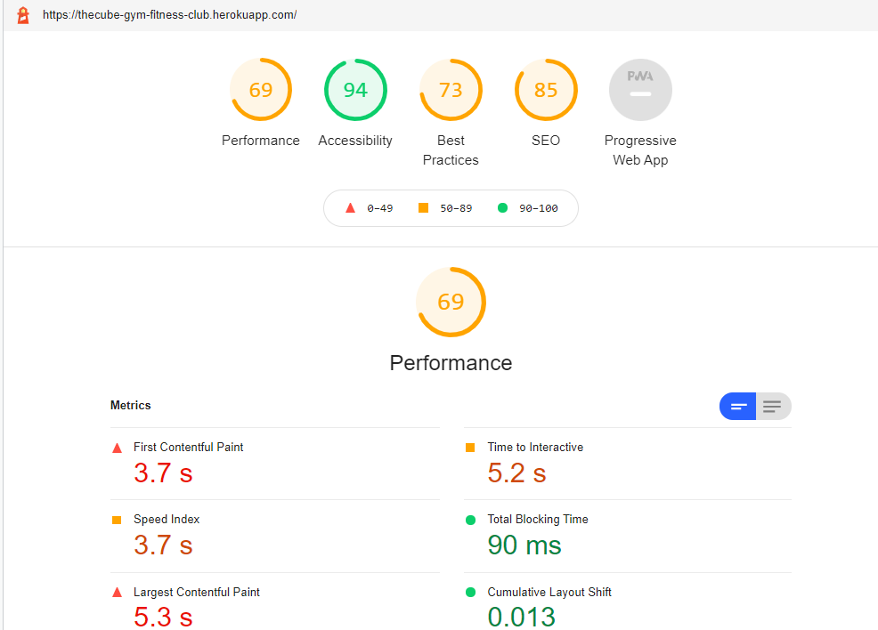

# Testing

## Code validation
Following resources were used for code validation
  - [Closing Tag Checker for HTML5](https://www.aliciaramirez.com/closing-tags-checker/) was using to validate all tags  
  - [W3C Markup Validation Service](https://validator.w3.org/) was using on this project.
  - [W3C CSS Validation Service](https://jigsaw.w3.org/css-validator/) was using on this project.
  - [JavaScript JSHINT Service](https://jshint.com/) was using for code warning & error check
  - [Python Syntax Checker](https://extendsclass.com/python-tester.html) was using to validate app.py file's code syntax error
  - [Python PEP8 requirements](http://pep8online.com/) was using to validate app.py file's code for PEP8 requirements

### HTML

- Ran HTML code through [W3C Markup Validation Service](https://validator.w3.org/) for code warning & error check.
  - One Warning message were received:
  - **Warning**: Section lacks heading. Consider using h2-h6 elements to add identifying headings to all sections.

- [Closing Tag Checker for HTML5](https://www.aliciaramirez.com/closing-tags-checker/) was using to validate all tags
  - No unclosed tags detected.

### CSS
- Ran CSS code through [W3C CSS Validation Service](https://validator.w3.org/) for code warning & error check.
  - No errors found.
  - Relevant logos are placed on homepage footer

### JavaScript
- Ran JavaScript code through [JavaScript JSHINT Service](https://jshint.com/) for code warning & error check.
The website is used a small amount of direct Javascript coding
  - The following (general) Warning messages were received:
  - Undefined variables

- All variables were fixed or ignored, as code is working properly

### Python
- [Python Syntax Checker](https://extendsclass.com/python-tester.html) was using to validate all python code file's for syntax error
  - No syntax errors detected 

- [Python PEP8 requirements](http://pep8online.com/) was using to validate all python code file's for PEP8 requirements.
  - The following warning messages were received:
    - E125 continuation line with same indent as next logical line
    - E128 continuation line under-indented for visual indent
    - W291 trailing whitespace
    - W292 no newline at end of file
    - E303 too many blank lines
    - W501 line too long

- All possible errors were fixed. Tor too long lines were changed indentation

## GENERAL (Manual testing)

**Homepage Page**
  - Clicked on header Logo icon, it goes to Home page.
  - Clicked on hamburger menu icon, it opens navigation from top.
  - Clicked on Shop navigation element, it goes to the relevant page.
  - Clicked on Activities navigation element, it goes to the relevant page.
  - Clicked on Stuff navigation element, it goes to the relevant page.
  - Clicked on Timetable navigation element, it goes to the relevant page.
  - Clicked on Log In navigation element, it goes to the relevant page.
  - Clicked on Register navigation element, it goes to the relevant page.
  - Clicked on Contact Us navigation element, it goes to the relevant page.
  - Clicked on Shopping Bag icon, it goes to the relevant page.
  - Clicked on Buy a Membership Button, it goes to the relevant page.
  - Clicked on Shop Now every Button on a page grid, every link goes to the relevant page.
  - Clicked on View Now Button on a page grid last section, link goes to the relevant page.
  - Clicked on Social links icons in the footer, each icon goes to the relevant page.
  - Clicked on Scroll Up icon in the footer, page goes to the top.

**Shop Page**
  - Clicked on header Logo icon, it goes to Home page.
  - Clicked on hamburger menu icon, it opens navigation from top.
  - Clicked on every header navigation elements, all of them goes to the relevant pages.
  - Added text to search box, it works properly
  - Added not searchable text, Got a notification Error! You didn't enter any search criteria.
  - Clicked on More Details Button on a page every product card, link goes to the relevant single product page.
  - Clicked on View Now Button on a page grid last section, link goes to the relevant page.
  - Clicked on Social links icons in the footer, each icon goes to the relevant page.
  - Clicked on Scroll Up icon in the footer, page goes to the top.

**Shop Page single product page**
  - Clicked on header Logo icon, it goes to Home page.
  - Clicked on hamburger menu icon, it opens navigation from top.
  - Clicked on every header navigation elements, all of them goes to the relevant pages.
  - Clicked on Keep Shopping Button on a page, link goes to the relevant all products page.
  - Clicked on Plus icon Button, product quantity is incrementing in a box every time every click.
  - Clicked on Minus icon Button, product quantity is decrementing in a box every time every click.
  - Clicked on Add to Bag Button, Got a notification Success. Added Product name to your bag.
  - Clicked on View Now Button on a page grid last section, link goes to the relevant page.
  - Clicked on Social links icons in the footer, each icon goes to the relevant page.
  - Clicked on Scroll Up icon in the footer, page goes to the top.

**Activities Page**
  - Clicked on header Logo icon, it goes to Home page.
  - Clicked on hamburger menu icon, it opens navigation from top.
  - Clicked on every header navigation elements, all of them goes to the relevant pages.
  - Clicked on Shop Now Button on a page grid last section, link goes to the relevant page.
  - Clicked on Social links icons in the footer, each icon goes to the relevant page.
  - Clicked on Scroll Up icon in the footer, page goes to the top.

**Stuff Page**
  - Clicked on header Logo icon, it goes to Home page.
  - Clicked on hamburger menu icon, it opens navigation from top.
  - Clicked on every header navigation elements, all of them goes to the relevant pages.
  - Clicked on More Details Button on a page every card, link goes to the relevant page.
  - Clicked on View Now Button on a page grid last section, link goes to the relevant single stuff personal page.
  - Clicked on Social links icons in the footer, each icon goes to the relevant page.
  - Clicked on Scroll Up icon in the footer, page goes to the top.

**Stuff Page single page**
  - Clicked on header Logo icon, it goes to Home page.
  - Clicked on hamburger menu icon, it opens navigation from top.
  - Clicked on every header navigation elements, all of them goes to the relevant pages.
  - Clicked on All Employees Button on a page, link goes to the relevant all stuff page.
  - Clicked on View Now Button on a page grid last section, link goes to the relevant page.
  - Clicked on Social links icons in the footer, each icon goes to the relevant page.
  - Clicked on Scroll Up icon in the footer, page goes to the top.

**Timetable Page**
  - Clicked on header Logo icon, it goes to Home page.
  - Clicked on hamburger menu icon, it opens navigation from top.
  - Clicked on every header navigation elements, all of them goes to the relevant pages.
  - Clicked on Download Timetable Button on a page grid, link opens timetable PDF file in a new tab.
  - Clicked on View Now Button on a page grid last section, link goes to the relevant page.
  - Clicked on Social links icons in the footer, each icon goes to the relevant page.
  - Clicked on Scroll Up icon in the footer, page goes to the top.

**Register Page**
  - Clicked on header Logo icon, it goes to Home page.
  - Clicked on hamburger menu icon, it opens navigation from top.
  - Clicked on every header navigation elements, all of them goes to the relevant pages.
  - Filled up form and submitted, it goes to email confirmation page.
  - Clicked on Shop Now Button on a page grid last section, link goes to the relevant page.
  - Clicked on Social links icons in the footer, each icon goes to the relevant page.
  - Clicked on Scroll Up icon in the footer, page goes to the top.

**Log In Page**
  - Clicked on header Logo icon, it goes to Home page.
  - Clicked on hamburger menu icon, it opens navigation from top.
  - Clicked on every header navigation elements, all of them goes to the relevant pages.
  - Filled up form and submitted, it goes to homepage and received notification Login success.
  - Clicked on Shop Now Button on a page grid last section, link goes to the relevant page.
  - Clicked on Social links icons in the footer, each icon goes to the relevant page.
  - Clicked on Scroll Up icon in the footer, page goes to the top.

**Empty Shopping Bag Page**
  - Clicked on header Logo icon, it goes to Home page.
  - Clicked on hamburger menu icon, it opens navigation from top.
  - Clicked on every header navigation elements, all of them goes to the relevant pages.
  - Clicked on Keep Shopping Button on a page grid, link goes to the relevant shopping page.
  - Clicked on View Now Button on a page grid last section, link goes to the relevant page.
  - Clicked on Social links icons in the footer, each icon goes to the relevant page.
  - Clicked on Scroll Up icon in the footer, page goes to the top.

**None Empty Shopping Bag Page**
  - Clicked on header Logo icon, it goes to Home page.
  - Clicked on hamburger menu icon, it opens navigation from top.
  - Clicked on every header navigation elements, all of them goes to the relevant pages.
  - Clicked on Plus icon Button, product quantity is incrementing in a box every time every click.
  - Clicked on Minus icon Button, product quantity is decrementing in a box every time every click.
  - Clicked on Update Button, product price is changing according to quantity - multiply by price or become empty on quantity 0.
  - Clicked on Keep Shopping Button on a page grid, link goes to the relevant shopping page.
  - Clicked on Secure Checkout Button on a page grid, link goes to the relevant check out page.
  - Clicked on View Now Button on a page grid last section, link goes to the relevant page.
  - Clicked on Social links icons in the footer, each icon goes to the relevant page.
  - Clicked on Scroll Up icon in the footer, page goes to the top.

**None Empty Shopping Bag Page**
  - Clicked on header Logo icon, it goes to Home page.
  - Clicked on hamburger menu icon, it opens navigation from top.
  - Clicked on every header navigation elements, all of them goes to the relevant pages.
  - Clicked on Plus icon Button, product quantity is incrementing in a box every time every click.
  - Clicked on Minus icon Button, product quantity is decrementing in a box every time every click.
  - Clicked on Update Button, product price is changing according to quantity - multiply by price or become empty on quantity 0.
  - Clicked on Keep Shopping Button on a page grid, link goes to the relevant shopping page.
  - Clicked on Secure Checkout Button on a page grid, link goes to the relevant check out page.
  - Clicked on View Now Button on a page grid last section, link goes to the relevant page.
  - Clicked on Social links icons in the footer, each icon goes to the relevant page.
  - Clicked on Scroll Up icon in the footer, page goes to the top.

**After login:**
**Profile Page**
  - Clicked on header Logo icon, it goes to Home page.
  - Clicked on hamburger menu icon, it opens navigation from top.
  - Clicked on every header navigation elements, all of them goes to the relevant pages.
  - Clicked on Go to Shop Button, it goes to the shopping page.
  - Clicked on Log Out Button, it goes to Log out page to confirm it. Relevant Success notification is displayed.
  - Clicked on Update Information Button, it goes to the user profile page with relevant Success notification.
  - Clicked on Add Product Button (for admin user), it goes to relevant page.
  - Clicked on View Now Button on a page grid last section, link goes to the relevant page.
  - Clicked on Social links icons in the footer, each icon goes to the relevant page.
  - Clicked on Scroll Up icon in the footer, page goes to the top.

**Check Out Page**
  - Clicked on header Logo icon, it goes to Home page.
  - Clicked on hamburger menu icon, it opens navigation from top.
  - Clicked on every header navigation elements, all of them goes to the relevant pages.
  - After filling up form fields and Clicked on Complete Order Button it goes to the relevant page.
  - Clicked on Adjust Bag Button it goes to the relevant page.
  - Clicked on View Now Button on a page grid last section, link goes to the relevant page.
  - Clicked on Social links icons in the footer, each icon goes to the relevant page.
  - Clicked on Scroll Up icon in the footer, page goes to the top.

**Add Product Page**
  - Clicked on header Logo icon, it goes to Home page.
  - Clicked on hamburger menu icon, it opens navigation from top.
  - Clicked on every header navigation elements, all of them goes to the relevant pages.
  - After filling up form fields and Clicked on Add Product Button it goes to the single product page.
  - Clicked on View Now Button on a page grid last section, link goes to the relevant page.
  - Clicked on Social links icons in the footer, each icon goes to the relevant page.
  - Clicked on Scroll Up icon in the footer, page goes to the top.

**Edit Product Page**
  - Clicked on header Logo icon, it goes to Home page.
  - Clicked on hamburger menu icon, it opens navigation from top.
  - Clicked on every header navigation elements, all of them goes to the relevant pages.
  - After updating form fields and Clicked on Update Product Button it goes to the single product page.
  - Clicked on View Now Button on a page grid last section, link goes to the relevant page.
  - Clicked on Social links icons in the footer, each icon goes to the relevant page.
  - Clicked on Scroll Up icon in the footer, page goes to the top.

### Cross Browser and Cross Device Testing

Testing was done for the following devices:

    |TOOL / Device    | BROWSER  |  OS         |  SCREEN WIDTH |
    |                 |          |             |               |
    | Desktop         | Edge     | windows 10  | 1920 x 1080   |
    | Desktop         | Chrome   | windows 10  | 1920 x 1080   |
    | Desktop         | Opera    | windows 10  | 1920 x 1080   |
    | Desktop         | Firefox  | windows 10  | 1920 x 1080   |
    | Desktop         | IE       | windows 10  | 1920 x 1080   |
    | Laptop          | Edge     | windows 10  | 1366 x 768    |
    | Laptop          | Chrome   | windows 10  | 1366 x 768    |
    | Laptop          | Opera    | windows 10  | 1366 x 768    |
    | Laptop          | Firefox  | windows 10  | 1366 x 768    |
    | Laptop          | IE       | windows 10  | 1366 x 768    |
    | MP Samsung S20+ | Chrome   | android     | 1440 x 3040   |
    | MP Samsung S20+ | Samsung  | android     | 1440 x 3040   |
    | ipad            | Chrome   | iOs         | 1024 x 768    |
    | ipad            | Safari   | iOs         | 1024 x 768    |

## Responsiveness
- Below is a picture of site that shows it in responsive states. 
[link to check a website to be responsive](http://ami.responsivedesign.is)

## Lighthouse performance

